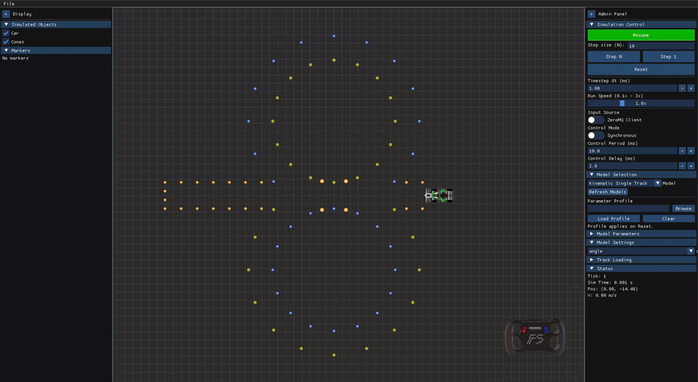

# lilsim
A simple 2D simulator for Formula Student Driverless.

 

The GIF above shows a demo in which a Jupyter notebook session (`python_sdk/testing.ipynb`) connects to the simulator, registers a callback for returning control commands to the simulator, and sends marker messages to visualize the state of the Pure Pursuit controller running in the notebook process.

## Quick Start

### Build & Run
```bash
cmake --preset debug
cmake --build --preset build-debug -j
./build/debug/app/lilsim
```

### Controls
- **WASD**: Drive the car (W=forward, S=brake, A=steer left, D=steer right). Only active when Input Source is set to "GUI".
- **Mouse scroll**: Zoom in/out
- **Tab**: Change camera mode

### Python Notebook algorithm development

See contents of `python_sdk/testing.ipynb` for example usage of the Python SDK.
It contains a simple example with a pure pursuit controller. 

---

# A Driverless Algorithm Prototyping Simulator

This simulator with working name **lilsim** aims to be an all-in-one tool for simulation and visualization for the purpose of developing algorithms for state estimation, planning and control --- specifically in the context of **Formula Student Driverless**, i.e., autonomous car racing where tracks are delineated by traffic cones.

## Notable Features

Some features sets lilsim apart from other simulation environments.  

**Vehicle model plugin system:** Allows users to write C++ plug-ins to define custom vehicle models. No limitations in how cars can be modeled. 

**Synchronous-control simulation:** (When in synchronous control mode) Simulator requests control input from user's process that runs the control algorithm, and doesn't proceed stepping until input is received. Results of simulation are thereby decoupled from vehicle model/algorithm computational efficiency.

**Portability:** The front-end GUI is built on a stack of GLFW, WebGPU and Dear ImGui, which supports compulation and execution on Linux, Windows and MacOS.

**User friendly:** Using the ROS 2 ecosystem or simulation (Gazebo + RViz) often ends up with four terminals and just as many GUIs open, with sometimes complex interdependency of processes. lilsim aims to restrict usage to one process for simulation and/or visualization (lilsim) and one for execution of algorithms (jupyter notebook, ROS 2 node, or other C++/Python program).

**Specific to FSD:** lilsim aims to simulate specifically the range of scenarios seen at Formula Student Driverless (FSD) competitions. This alleviates the burden of having to describe the FSD environment in more general simulation frameworks. 